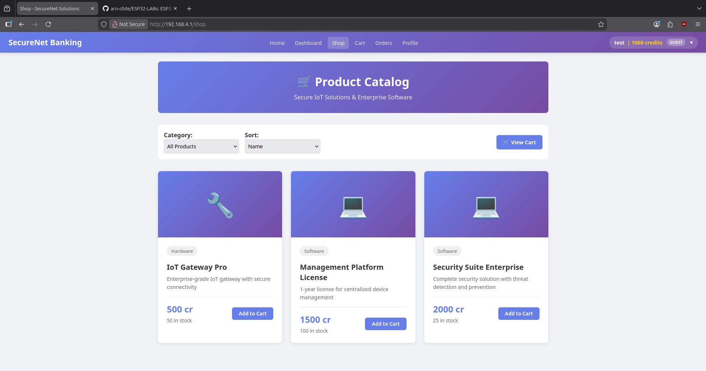

# ESP32-H4CK - "SecureNet Solutions" Vulnerable Lab

**Version:** 1.0.3 | **Platform:** ESP32 | **Framework:** Arduino  
**Quick Start:** See [QUICKSTART.md](QUICKSTART.md) for step-by-step setup guide.

**Repository Governance:** [CONTRIBUTING.md](../CONTRIBUTING.md) | [SECURITY.md](../SECURITY.md) | `LICENSE`  
**Security Contact:** arn-c0de@protonmail.com

## Project Overview

ESP32-H4CK is an intentionally vulnerable IoT web application built for cybersecurity training and hands-on penetration testing exercises. It runs on an ESP32 microcontroller and provides a realistic-looking company website ("SecureNet Solutions") while exposing hidden endpoints, admin panels, and a wide range of intentionally insecure services for safe lab practice.

> ⚠️ WARNING: This project intentionally contains many security vulnerabilities. Use only in isolated, controlled lab environments. Do NOT connect to production networks or the internet.

---

## What's New in 1.0.3 ✅

### LAB_MODE System
- **Three operational modes**: `testing` (educational hints visible), `pentest` (realistic assessment), `realism` (maximum security)
- Dynamic mode switching via API: `POST /api/config/lab-mode`
- Persistent configuration stored in ESP32 preferences
- Frontend visibility controls hide/show vulnerable endpoints based on mode

### Wallet & Shop Systems
- **Wallet Banking**: Per-user credit balances, transaction history, P2P transfers
- **E-Commerce Shop**: Product catalog, shopping cart, checkout with intentional IDOR vulnerabilities
- **Admin Dashboard**: User management, product CRUD, order monitoring
- See [WALLET_AND_SHOP_IMPLEMENTATION.md](WALLET_AND_SHOP_IMPLEMENTATION.md) for details

### UI/UX Improvements
- Unified navbar with dropdown across all pages (Dashboard, Profile, Transactions, Shop, Cart, Orders, Admin)
- English translations throughout interface
- Cookie-to-localStorage authentication sync fixes dropdown navigation
- Mode-based visibility: endpoints/services hidden in pentest/realism modes
- Admin-only elements hidden for non-admin users

### Technical Updates
- Expanded LittleFS partition from 192KB to 1.2MB
- Shop cart API uses JSON format (not FormData)
- Enhanced upload script with automatic dependency management
- Persistent LAB_MODE configuration across reboots

---

## Key Features & Services 🔧

### Web Services
- **HTTP/HTTPS Server** (Port 80/443)
  - Realistic company website (home, about, products, support)
  - Hidden vulnerable endpoints for penetration testing
  - Admin and guest roles with session management

- **RESTful API** (`/api/*`)
  - System info, authentication, endpoint discovery
  - Wallet operations (balance, transfer, deposit, withdraw)
  - Shop operations (products, cart, orders, checkout)
  - Administrative actions and configuration

- **WebSocket Shell** (`/shell.html`, `ws://<device>/shell`)
  - Interactive command execution
  - Simulated privilege escalation scenarios

- **Telnet Service** (Port 23)
  - Multiple concurrent client connections
  - Weak authentication options
  - Privilege escalation training exercises

### Defense & Lab Controls
- **🎮 Defense System** - Application-level security simulation
  - IP blocking (iptables-like syntax)
  - Rate limiting (tc-like syntax)
  - Session management and reset
  - Resource management: DP/AP/SS system
  - Serial command interface for Red/Blue Team exercises

- **LAB_MODE Configuration** - Progressive difficulty levels
  - `testing`: Educational mode with hints visible
  - `pentest`: Realistic assessment with hidden endpoints
  - `realism`: Maximum security, minimal disclosure

### Data Storage
- **LittleFS Filesystem** (1.2MB partition)
  - Web assets (HTML/CSS/JS)
  - User uploads and backups
  - JSON-based databases (users, products, orders, transactions)
  - Intentionally exposed sensitive files

---

## Intentional Vulnerabilities (Full list) 🧪

  
<strong>Show full vulnerability categories and implemented routes (click to reveal)</strong>

- **A01: Broken Access Control / Privilege Escalation**
  - `/api/wallet/balance?user_id=X` — IDOR: Access any user's wallet balance
  - `/api/shop/order?order_id=X` — IDOR: View/modify any order without authorization
  - `/api/admin/users-export` — Export all users (CSV) **NO AUTH** in vulnerable mode
  - `/api/admin/sessions` — List active sessions (IDs, usernames, IPs)
  - `/vuln/user?id=X` — IDOR: Access arbitrary user profile data

- **A02: Cryptographic Failures & Secret Exposure**
  - `/api/jwt-debug` — Exposes `JWT_SECRET_STR`, accepts weak algs, exploitation hints
  - `/.env` — Direct exposure of secrets via filesystem route
  - `/api/cookies/info` — Documents insecure cookie settings

- **A03: Injection (SQL, Command, XSS, XXE)**
  - `/vuln/search?q=` — SQL Injection (boolean, UNION, stacked queries)
  - `/vuln/ping?host=` — Command injection via ping parameter
  - `/vuln/comment` (POST) & `/vuln/comments` (GET) — Stored XSS
  - `/api/xml-parse` — XXE demonstration (can return local file contents)
  - `/vuln/deserialize` — Insecure deserialization of JSON

- **A04/A05: Misconfiguration & Information Disclosure**
  - `/.git/config` — Git repo information leak
  - `/backup/*` — Backup files including DB dumps and `.env.backup`
  - `/robots.txt` — Lists sensitive/hidden paths
  - HTTP headers intentionally disclose Server/X-Powered-By/X-Framework/X-Device/X-Firmware

- **A06/A07: Broken Authentication & Session Management**
  - Default weak credentials (admin/admin, guest/guest)
  - `/api/auth/bruteforce-test` — No rate limiting for brute-force practice
  - `/api/auth/session-fixation` — Accepts attacker-provided session_id
  - `/vuln/session` — Predictable session IDs

- **A08: Insecure Deserialization & Unsafe Deserialization**
  - `/vuln/deserialize` — Processes unvalidated JSON (simulate unsafe object handling)

- **A09: Logging & Monitoring Falters**
  - `/api/admin/logs` — Logs available without auth
  - Telnet/WebSocket/HTTP requests are logged verbosely for forensic practice

- **A10: File Upload / SSRF / Race Conditions / Financial**
  - `/api/upload` — Unrestricted file upload (no extension/type checks)
  - `/api/fetch?url=` — SSRF: Fetch arbitrary URLs (including file://, localhost)
  - `/api/wallet/transfer` — Race condition: Multiple simultaneous transfers bypass balance checks
  - `/api/shop/checkout` — Race condition: Double-spend vulnerability
  - `/api/shop/order/delete` — Delete orders without refund (financial loss)
  - `/api/redirect?url=` — Open redirect endpoint
  - `/api/frame-test` — Clickjacking test (no X-Frame-Options)

> Tip: Details are collapsed by default to avoid spoiling exercises. Click to reveal when you're ready to begin hands-on testing.

---

## Quick Start (Hardware & Software)

**Detailed Guide:** See [QUICKSTART.md](QUICKSTART.md) for complete setup instructions.

**Hardware Requirements:**
- ESP32 board (4MB+ flash, PSRAM recommended)
- USB cable for programming
- Isolated WiFi network or dedicated VLAN

**Software Requirements:**
- Arduino IDE (1.8+/2.x) or `arduino-cli`
- Serial monitor tool (`picocom`, Arduino Serial Monitor)
- Python 3.x (for upload scripts)

**Required Libraries:**
- ESPAsyncWebServer (Me-No-Dev)
- AsyncTCP (Me-No-Dev)
- ArduinoJson (Benoit Blanchon)
- LittleFS (built-in)

**Quick Setup:**
1. Clone repository and navigate to `ESP32-H4CK/`
2. Copy `.env.example` to `.env` and configure WiFi credentials
3. Install required libraries via Arduino Library Manager
4. Build firmware: `./build.sh`
5. Upload to device: `./upload.sh` (handles firmware + filesystem)
6. Monitor serial output: `./monitor.sh` (115200 baud)
7. Access web interface at IP shown in serial output

---

## Useful Endpoints (complete list)

  
<strong>Show all implemented endpoints and short descriptions (click to reveal)</strong>

### Public & UI Pages
- `/` — SecureNet Solutions homepage
- `/dashboard` — User wallet dashboard (balance, transactions)
- `/shop` — E-commerce product catalog
- `/cart` — Shopping cart management
- `/orders` — Order history with IDOR testing panel
- `/login` — Authentication page
- `/admin` — Admin panel (user/product/order management)
- `/shell.html` — WebSocket shell interface

### Recon & Exposed Files
- `/.git/config` — Exposed git config (repo info)
- `/.env` — Exposed environment/config secrets
- `/backup/` — Backup files (DB dumps, `.env.backup`, private keys)
- `/robots.txt` — Lists hidden paths

### Vulnerability Practice Endpoints
- `/vuln/search?q=` — SQL Injection lab (boolean/UNION examples)
- `/vuln/comment` (POST) and `/vuln/comments` (GET) — Stored XSS lab
- `/vuln/download?file=` — Path traversal (try `../../../.env` or `/etc/passwd`)
- `/vuln/ping?host=` — Command injection practice
- `/vuln/transfer` (POST) — CSRF lab (no token required)
- `/vuln/user?id=` — IDOR (insecure direct object reference)
- `/vuln/user-profile?user_id=` — Enhanced IDOR returning sensitive fields
- `/vuln/deserialize` (POST) — Insecure deserialization testing
- `/vuln/logs` — Expose application logs
- `/vuln/session` — Create predictable sessions for hijacking tests
- `/vuln/profile` (POST) — Mass-assignment vulnerability

### REST API & Admin Practice
- `/api/login` (POST) — Authenticate (weak by default)
- `/api/info` — System information including LAB_MODE
- `/api/config/lab-mode` (POST) — Change lab mode: `{"mode":"testing|pentest|realism"}`
- `/api/wallet/balance?user_id=X` — Get balance (IDOR vulnerability)
- `/api/wallet/transfer` (POST) — P2P credit transfer (race condition)
- `/api/shop/products` — Get product catalog
- `/api/shop/cart/add` (POST) — Add to cart: `{"product_id":"PROD001","quantity":1}`
- `/api/shop/checkout` (POST) — Place order (race condition)
- `/api/shop/order?order_id=X` — Get order details (IDOR)
- `/api/endpoints` — Endpoint discovery API

### Advanced / Admin / Exploitable APIs
- `/api/upload` (POST) — Unrestricted file upload (upload a webshell)
- `/api/fetch?url=` — SSRF: fetch internal URLs or file:// paths
- `/api/xml-parse` (POST) — XXE practice (external entity file disclosure)
- `/api/wallet/withdraw` (POST) — Race condition lab (no locking)
- `/api/auth/session-fixation` — Accept attacker-provided session_id
- `/api/user/email` — HTTP Parameter Pollution practice
- `/api/redirect?url=` — Open redirect test
- `/api/frame-test` — Clickjacking frame test
- `/api/documents?doc_id=` — IDOR: fetch arbitrary document

### Admin Endpoints (deliberately exposed for practice)
- `/api/admin/users-export` — Export users as CSV **NO AUTH** (lab)
- `/api/admin/logs` — Expose system logs **NO AUTH**
- `/api/admin/sessions` — List active sessions
- `/api/admin/config-update` (POST) — Change config values (WiFi/JWT)
- `/api/system/reboot` — Reboot the device (DoS vector)
- `/api/auth/bruteforce-test` — Brute-force testing (no rate limit)
- `/api/cookies/info` — Cookie security info & exploit examples

### Other services
- Telnet (Port 23): `telnet <device-ip> 23` — Interactive shell with privilege escalation lessons (SUDO bypass, SUID discovery, PATH/LD_PRELOAD hijack)

### 🎮 Defense System Commands (Serial Interface)

  
<strong>⚠️ SPOILER: Contains Defense System Commands & Configuration - Click to reveal</strong>

All defense commands are available via serial monitor (115200 baud) and simulate application-level enforcement:

**IP Blocking (iptables-like)**
- `iptables -A INPUT -s <ip> -j DROP --duration <sec>` — Block IP temporarily
- `iptables -D INPUT -s <ip> -j DROP` — Remove IP block
- `iptables -L` — List active blocking rules

**Rate Limiting (tc-like)**
- `tc qdisc add rate-limit --src <ip/range> --duration <sec>` — Apply rate limit
- `tc qdisc del rate-limit --src <ip>` — Remove rate limit
- `tc qdisc show` — Show active rate limits

**Session Management**
- `session reset --ip <ip>` — Force disconnect all sessions from IP

**Defense Status & Configuration**
- `defense status` — Show DP/AP/SS resources and active rules
- `defense config show` — Display current cost/cooldown configuration
- `defense config set dp=<n> ap=<n> stability=<n>` — Adjust resource limits

**Resource Costs (Default)**
- IP Block: DP=15, AP=1, Cooldown=60s
- Rate Limit: DP=10, AP=1, Cooldown=30s  
- Session Reset: DP=25, AP=1, Cooldown=90s

> ⚠️ Note: Defense rules are enforced at **application level only** — not kernel/network stack. Perfect for safe lab education without system changes.

- WebSocket: `ws://<device-ip>/shell` — Browser shell endpoint

> Note: Endpoints are listed for lab practice. Many admin endpoints deliberately lack authentication or have weak protections — use only in isolated lab environments.
---

## Safety & Lab Deployment Guidelines 🛡️

⚠️ **CRITICAL**: This system contains intentional vulnerabilities. Use ONLY in isolated environments.

**Network Isolation:**
- Use dedicated VLAN or isolated WiFi SSID
- Implement firewall rules blocking internet access
- No connection to production networks
- Air-gap from sensitive systems

**Physical Security:**
- Lock physical access to lab
- Label all devices clearly as "VULNERABLE LAB"
- Control who has physical access

**Documentation & Oversight:**
- Obtain signed participant agreements
- Document all lab activities and exercises
- Monitor participant activity logs
- Have incident response plan ready

**LAB_MODE Best Practices:**
- Start students in `testing` mode with hints visible
- Progress to `pentest` mode for realistic assessment
- Use `realism` mode only for advanced students
- Switch modes via: `POST /api/config/lab-mode` with `{"mode":"testing|pentest|realism"}`

> **⚠️ Important — Reveal Hints / Spoilers in the Live Web App:**
>
> To have the app display inline hints and `testing`-only spoilers on pages, set the LAB_MODE to `testing`. Methods:
>
> - Edit your `.env` and set `LAB_MODE=testing`, then rebuild/upload firmware (recommended for persistent setups).
> - Or change the running device via API: `POST /api/config/lab-mode` with `{"mode":"testing"}` (e.g. `curl -X POST -H "Content-Type: application/json" -d '{"mode":"testing"}' http://<device-ip>/api/config/lab-mode`).
> - For quick local changes in source: change the compile-time define in `ESP32-H4CK.ino` from `#define LAB_MODE "pentest"` to `#define LAB_MODE "testing"` and rebuild.
>
> When `testing` is active, UI elements marked with the `.testing-only` class and additional hint text are visible — use only in isolated lab environments.

---

## Development & Contributing

**Adding New Vulnerabilities:**
1. Add vulnerability flag in `01_Config.ino` (e.g., `VULN_NEW_ATTACK`)
2. Implement endpoint in appropriate module (`09_Vulnerabilities.ino`, `14_AdvancedVulns.ino`)
3. Add UI hints in `data/*.html` pages (use `.testing-only` class for LAB_MODE control)
4. Document in README.md and create test cases
5. Update QUICKSTART.md with testing examples

**Frontend Development:**
- Use unified navbar via `navbar.js` dropdown system
- Add pages to `data/` directory
- Include `auth-sync.js` in `<head>` for authentication
- Use `mode.js` for LAB_MODE visibility controls
- Follow CSS classes: `.testing-only`, `.admin-only`, `.shell-link`

**Contributing Guidelines:**
- Follow existing code structure and naming conventions
- Test thoroughly in all three LAB_MODEs
- Include clear documentation in commit messages
- Open PRs for review before merging
- See [CONTRIBUTING.md](../CONTRIBUTING.md) for details

---

## Changelog

### Version 1.0.3 (February 2026)
- **LAB_MODE System**: Three operational modes (testing/pentest/realism) with dynamic switching
- **Wallet Banking**: Complete credit system with IDOR and race condition vulnerabilities
- **E-Commerce Shop**: Product catalog, cart, checkout with order hijacking scenarios
- **UI Overhaul**: Unified navbar dropdown, English translations, cookie-to-localStorage sync
- **Partition Expansion**: LittleFS increased from 192KB to 1.2MB
- **API Improvements**: JSON format for cart operations, persistent mode configuration
- **Documentation**: Comprehensive WALLET_AND_SHOP_IMPLEMENTATION.md added

### Version 1.0.1 (2026)
- Advanced vulnerability modules (file upload, SSRF, XXE, session fixation)
- Privilege escalation training in Telnet
- Red/Blue Team defense game with resource management
- Recon endpoints (`.git/config`, `.env`, `/backup/*`)
- Enhanced build/upload scripts

### Version 1.0.0 (2026)
- Initial public release with baseline lab features

---

## License & Ethics
Educational Use Only — NOT for production. Use only for training in a controlled environment.

---

If you want, I can also:
- Add short lab exercises per endpoint (beginner → advanced)
- Export a printable quick-lab worksheet

---

**Remember**: This is an intentionally vulnerable system. Use responsibly and only in controlled lab environments.

